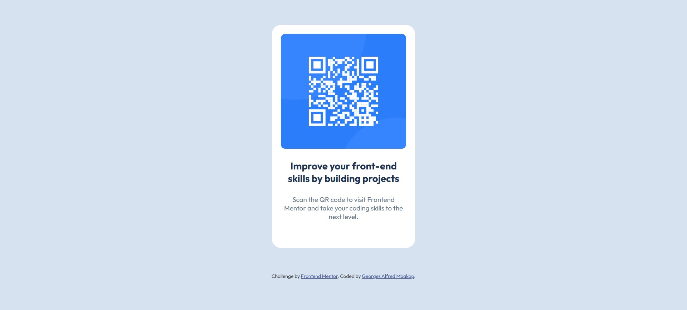

# Frontend Mentor - QR code component solution

This is a solution to the [QR code component challenge on Frontend Mentor](https://www.frontendmentor.io/challenges/qr-code-component-iux_sIO_H). Frontend Mentor challenges help you improve your coding skills by building realistic projects. 

## Table of contents

- [Overview](#overview)
  - [Screenshot](#screenshot)
  - [Links](#links)
- [My process](#my-process)
  - [Built with](#built-with)
  - [What I learned](#what-i-learned)
  - [Continued development](#continued-development)
  - [Useful resources](#useful-resources)
- [Author](#author)
- [Acknowledgments](#acknowledgments)

**Note: Delete this note and update the table of contents based on what sections you keep.**

## Overview

### Screenshot




### Links

- Solution URL: [Add solution URL here](https://github.com/giogio2305/qr-code-challenge)
- Live Site URL: [Add live site URL here](https://qr-code-challenge-seven-teal.vercel.app/)

## My process

### Built with

- Semantic HTML5 markup
- CSS custom properties
- Flexbox
- Mobile-first workflow

### What I learned

Use this section to recap over some of your major learnings while working through this project. Writing these out and providing code samples of areas you want to highlight is a great way to reinforce your own knowledge.

To see how you can add code snippets, see below:

```html
      <figure class="card__image-container">
        
      </figure>
```
```css
.card__image-container {
    width: 100%;
    height: 56%;
    border-radius: 10px;
    overflow: hidden;
}
.card__image {
    width: 100%;
    height: 100%;
    object-fit: cover;
}
```

### Useful resources

- [Understanding the CSS BEM convention](https://www.geeksforgeeks.org/css/understanding-the-css-bem-convention/) - This helped me for CSS naming convention and code structure. I really liked this pattern and will use it going forward.
- [Semantic HTML5 Elements Explained](https://www.freecodecamp.org/news/semantic-html5-elements/) - This is an amazing article which helped me finally understand Semantic HTML5 markup. I'd recommend it to anyone still learning this concept.


## Author

- Frontend Mentor - [@giogio2305](https://www.frontendmentor.io/profile/giogio2305)
- GitHub - [giogio2305](https://github.com/giogio2305)
- Twitter - [@georgesalfredM](https://www.twitter.com/georgesalfredM)

